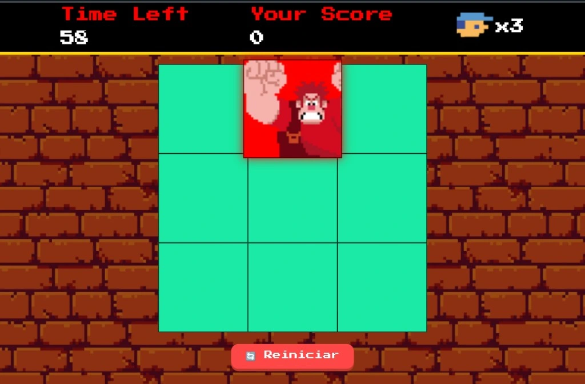

# 🎯 Acerte o Detona Ralph

Bem-vindo(a) ao **Acerte o Detona Ralph**!  
Um mini game divertido onde você deve ser rápido(a) e clicar no quadrado onde o Ralph aparece.  
Feito com **HTML**, **CSS** e **JavaScript** puro. 🚀

## 🕹️ Como jogar

1. O jogo começa automaticamente.
2. Ralph aparece aleatoriamente em um dos quadrados da tela.
3. Clique nele o mais rápido possível para marcar pontos.
4. Você tem 60 segundos ⏱️ para marcar o maior número de pontos possível.
5. Ao final do tempo, sua pontuação será exibida.

## 📸 Preview

## 🔁 Botões

- **🔄 Jogar Novamente**: Reinicia o jogo sem precisar recarregar a página.
- **🏁 Fim de Jogo**: Aparece automaticamente com a pontuação final ao fim do tempo.

## 🧠 Código comentado

Todo o código está **comentado linha por linha**, para facilitar o aprendizado e entendimento de quem estiver lendo. ✍️  
Ideal para quem está estudando JavaScript e quer aprender com um projeto prático. 📚

## 🛠️ Tecnologias usadas

- HTML5
- CSS3
- JavaScript

## 💡 O que aprendi com esse projeto:

- Manipular o DOM com JavaScript
- Trabalhar com `setInterval` e `clearInterval`
- Adicionar e remover classes dinamicamente
- Criar modais e eventos de clique
- Criar e controlar estados de jogo
- Boa organização do código com comentários e funções reutilizáveis

## ✨ Funcionalidades extras

- Modal animado ao fim do jogo com pontuação
- Botão com rotação ao ser clicado
- Sons ao clicar corretamente no Ralph
- Reinício do jogo sem recarregar a página
- Contador regressivo de tempo

## 🚀 Vamos jogar?

---

---

## 🙋‍♀️ Desenvolvido por

Feito com 💜 por **Karla Cristina Almeida da Silva**  
📧 karlakryz.codes@outlook.com  
🚀 [linkedin.com/in/karla-almeida-7761932b0](https://www.linkedin.com/in/karla-almeida-7761932b0)

---

🧠 Projeto desenvolvido como parte do **Desafio de Projeto da DIO (Digital Innovation One)**.  
🎮 O objetivo era criar um mini jogo interativo com HTML, CSS e JavaScript, treinando lógica e DOM.

📝 Licença
Este projeto está sob a licença MIT. Sinta-se livre para usar e modificar! 🤝

